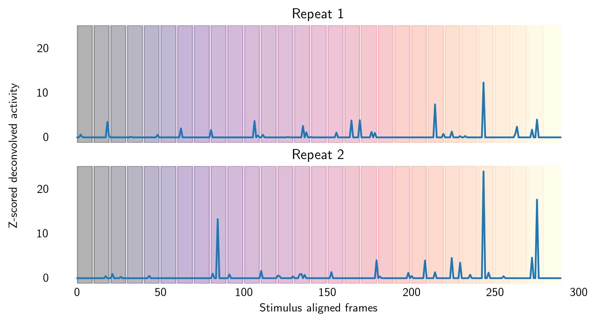

# Audio-visual integration in the mouse cortex

## AKA what I plan to do during my PhD

### Tim Sit

### 2020 February 24 

<!--h-->

## Outline 

 1. General thoughts about studying audio-visual intgeration
 2. Passive audio-visual response: experiment design and some preliminary analysis 
 3. Audio-visual decision making: electrophysiology analysis from Pip's data
 

<!--h-->

## What is a multimodal neuron?

*Neuron respond to presense / specific property of more than one sensory modality.*

 

 

<!--h-->

## Where does multimodal integration occur? 

 

	
 <!--h-->

## What is the relationship between multimodal response and unimodal response?

 

$$
f(A + V) = f(A) + f(V)
$$

 

$$
f(A + V) = f(A) + f(V) + f(A, V)
$$

<!--h-->

### What are the neural mechanisms of multimodal decision making?

<!--v-->

<!--h-->

### Two main experiments to tackle the above questions 

Passive video presentation

<video controls width="500">
	   <source src="./videos/seal.webm" type="video/webm">
	    <source src="./videos/seal.mp4" type="video/mp4" >
</video>

Audio-visual decision making task 

<!--v-->

## What determines whether multisensory activity will occur/develop? 

 - temporal coherence?
 - is supervised learning required for multimodal integration in the cortex? 
     - eg. associating reward / punishment to specific audio-visual pair 
	 - eg. decision making task

<!--h-->

## Filmworld: passive presentation of video with natural scene statistics

 

<!--v-->

<!--v-->

Overall session structure 

Individual trial structure

 <!-- .element  width="60%"; style="margin:auto;display:block" -->

 <!--v-->
 
Three presentation methods being tested 

Gray interval (4 seconds / video)

Continuous (6 seconds / video)

Fading (6 seconds / video)

 

 
 <!--v-->
 
 
 Why natural videos > gratings / pure tones:
  
   - high dimensional
	  - look at high dimensional neural activity 
	  - more likely to evoke audio-visual activity
   - (ecologically relevant?)
 
  <!--v-->
  
<!--h-->

## Filmworld: example activity from one experiment

 <!--v-->
 
### Mean activity of a neuron to each audio-video pair 

 <!--v-->

### Recording from 12 planes 

The first plane is always removed from analysis.

 <!--v-->
 
### There is more activity when a movie is playing 

<!--h-->

## Does PPC/V1 contain information about video and/or audio stimulus?

Population decoding approach

 <!-- .element  width="40%"; style="margin:auto;display:block" -->

<!--v-->

  
### Decoding using different classifiers 

<!--v-->

### Another example 

 

<!--v-->

### Other ideas

 - look at one-to-one decoding 
 - tune reguarlisation parameter
 

<!--h-->

## Looking at audio / visual response in individual neurons 

by looking at correlation across repeats

<!--v-->

<!--h-->

some neurons seem to care about auditory stimulus

<!--v-->

<!--h-->

## Are neurons more correlated in video-only conditions than audio-only conditions?

 <!-- .element  width="60%"; style="margin:auto;display:block" -->

<!--h-->

## Are neurons more correlated in video-only conditions than audio-only conditions?

 <!-- .element  width="60%"; style="margin:auto;display:block" -->

<!--v-->

 <!-- .element  width="60%"; style="margin:auto;display:block" -->

<!--h-->

 <!-- .element  width="60%"; style="margin:auto;display:block" -->

 <!-- .element  width="60%"; style="margin:auto;display:block" -->

<!--h-->

### Future directions

1. Improve recording of timing of stimulus onset (esp. auditory stimulus)
2. Correlate neural activity with audio energy, video energy, and body movement
3. Auditory cortex recording

<!--h-->
 

## Multispaceworld: neural basis of multisensory decision making

<!--v-->

Race model

Drift model

 <!-- .element  width="50%"; style="margin:auto;display:block" --> 

<!--v-->

<!--h-->

## MOs contains information about choice 

and as demonstrated by optogenetic inactivation, is necessary for multisensory decision making

<!--v-->

Aligned to stimulus

 

Aligned to movement

<!--v-->

<!--v-->

Choice information comes early

<!--v-->

Some MOs respond in both active and passive condition

<!--v-->

Some are just related to movement

<!--h-->

## MOs may not be purely motor 

Passive direction-dependent auditory response in MOs 

 <!-- .element  width="100%"; style="margin:auto;display:block" -->

 <!-- .element  width="100%"; style="margin:auto;display:block" -->

<!--v-->

### Decoding of auditory direction in passive condition is poor using all neurons

Decoding audio left/right in the same experiment as the example cell shown before 

 <!-- .element  width="60%"; style="margin:auto;display:block" -->

<!--v-->

### MOs responds to audio onset in passive conditions 

<!--v-->

### Time of auditory and visual information 

Observation: 

 - auditory response is faster than visual response 
 - auditory response show an early peak and late peak in activity

Hypothesis: 

 - early peak in auditory response may signal auditory presense 
 - whereas late auditory activity may signal auditory direction 
 - this may explain auditory dominance effect observed in go/no-go task 
 
 
 
 
 <!--v-->
 
 
  

<!--v-->

 
 <!--h-->
 

# Future directions 

 
1. More analysis of time course of audio and visual information 
2. Relate auditory/visual bias in behaviour with neural activity
3. Summarise main neuron types in MOs
 
 
 
 

 <!--h-->
 
# Thanks to 

 - Pip: ephys analysis, rigbox help and rich tea biscuits
 - St&eacute;phane, Sam, Lauren, Michael: 2P 
 - Charu: surgery and animals
 - Bex: animals
 - Anwar, Kush, Sam, C&eacute;lian: analysis discussions 
 - Jai and Miles: setting up video playback in rigbox-signals

 <!--v-->
 
## Technical acknowledgments 

 - running experiments: rigbox, signals
 - 2P data processing: suite2p, facemap 
 - Data organisation: xarray, dask, pandas
 

 <!--h-->

## Other ideas

<!--v-->

## Filmworld for addressing the how question of multisensory integration 

 - present set of stimulus multiple times 
 - some of them temporally coherent and 'true' (occurs in nature)
 - some of them temporally incoherent and 'true' (animal and some background sound) 
 - some of them temporally coherent but false (artificial sounds, dubbing) 
 - some of them temporally inchoerent and false (random video and random audio)

 

