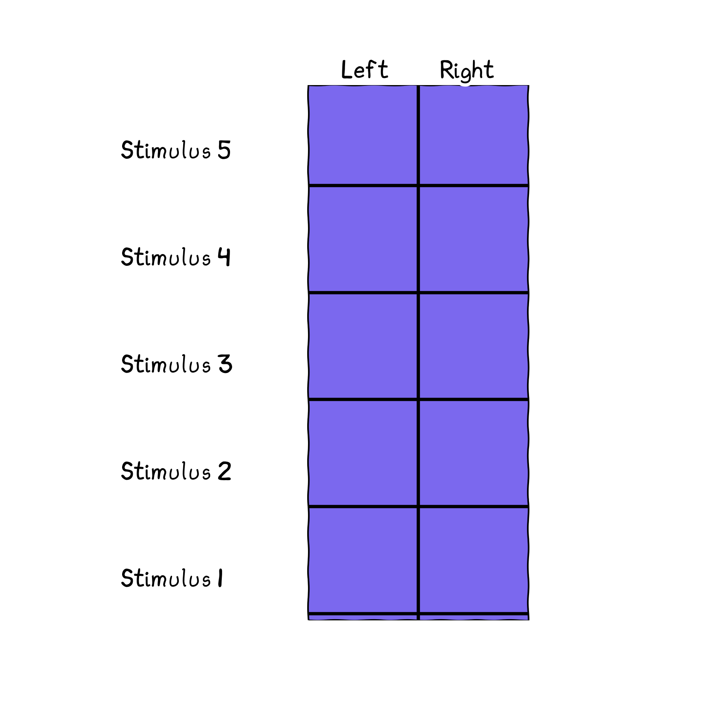
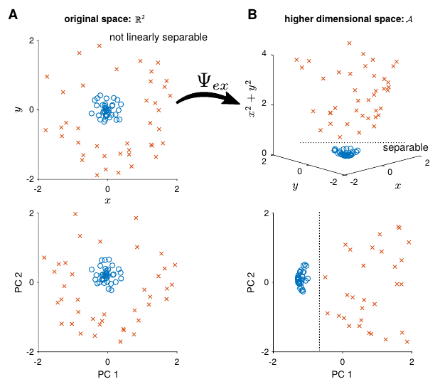
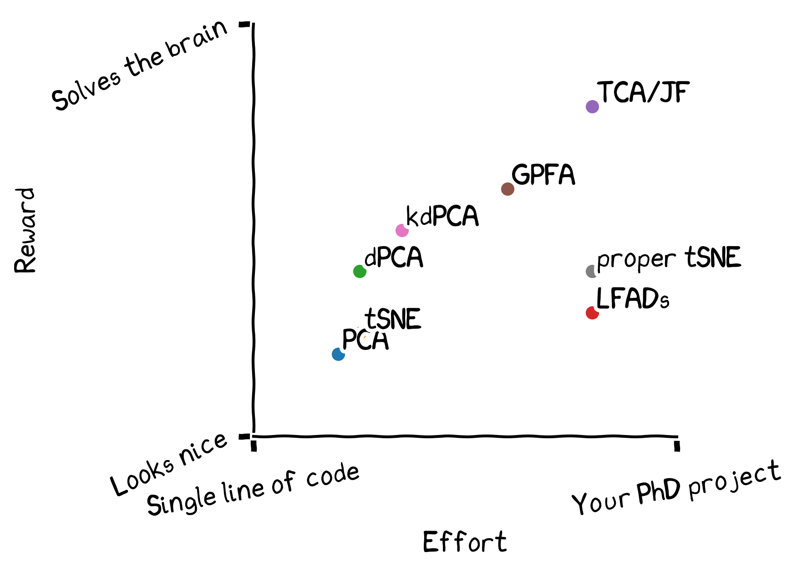

# Demixing and summarising neural activity 

<!--h-->

## Introduction

We have data (spike trains). Loads of it. 

**What do we do???**

<!--v-->

### What needs to be demixed? 

Mixed selectivity: individual neurons are modulated by multiple task parameters (cite: Raposo Kaufman Churchland (2014))

(maybe cite more papers on mixed selectivity; but only if footnote is possible)

mixed selectivity at the level of: 

 - individual neurons: neuron codes for both $x$ and $y$,  
 - population
  - part of population code for $x$, part of population codes for $y$
  - OR all individual neurons have mixed selectivity 
  
 

<!--v-->
  
  
### What is "summarising"?

 - we want to describe the dynamics of neural activity in lower dimensions 
 - ie. explains variability of the data: both variability due to task parameters and intrinsic stochasticity (the neuron is irregular)
  - you want resonstruct your data with lower dimensions 
  
<!--h-->

## Approaches

| Method | Demix? | Summarise? | Cool? |
|---------|---------|----------|--|
| statistical test | Yes | No | No.. |
| LDA | Yes | No | Meh |
| PCA, GPFA, ... | No | Yes | I guess |
| dPCA | Yes | Yes | 
&#129321;
 |

We'll focus on [Kobak et al 2016: Demixed principal component analysis of neural population vector](https://elifesciences.org/articles/10989)

<!--v-->

### Traditional statistical tests

 - The 'standard' approach of neuroscience: performing a t-test (or any two-sample comparison test) of the firing rate of each neuron before and after the stimulus/response can be thought of as demixing. 
  - you find $x$ % of neurons that respond to $a$ and $y$ % of neurons that respond to $b$
  - however, you limit the space of neural activity which you think provides information about the stimulus; you only consider single neuron coding of variables
  - a better approach will be to consider the activity of all neurons together: do demixing at the population level 
  

<!--v-->

### PCA: Quick introduction

We want to summarise high dimensional neural activity in lower dimensions to make it easier to visualise / interpret the data. 

http://setosa.io/ev/principal-component-analysis/

<!--v-->

### PCA: Quick introduction 

Matrices transform vectors. 

<iframe frameborder="0" width="100%" height="500pt" src="https://ncase.me/matrix/"></iframe>

<!--v-->

### PCA: projections 

 

A non-square matrix performs a projection when it transform a vector to a space with different dimension.

 - number of columns: dimension of your input 
 - number of rows: dimension of your output
 
 

 

 

Example: transform vector by a  1 by 2 matrix: $$A\vec{v} = \begin{bmatrix} 1 & 2 \end{bmatrix}\begin{bmatrix} v_1 \\\\ v_2\end{bmatrix}$$

 <!-- .element height="70%" width="70%"; -->

<!--v-->

### PCA: objective 

PCA tries to find the projection matrix that minmise reconstruction error: 

$$
\vert \vert X - D^\intercal D X \vert\vert^2
$$

where: 

 - $D$ is a fat short matrix (column > row)
 - $DX$ is the projection to your PC space 
 - $D^\intercal (DX)$ projects back (reconstruct) to the original space 
 
<!--v-->

### PCA: demo 

<iframe frameborder="0" width="100%" height="500pt" src="http://setosa.io/ev/principal-component-analysis/"></iframe>

 
<!--v-->

 
### dPCA 

We start with our data $X$  (dimensions: $N \times KSQT$)
- $K$ trials 
- $S$ stimulus 
- $Q$ decisions 
- $T$ time bins 
 
We decompose the activity of each neuron by the contribution of each experiment variable and their interactions: 

 

`$$ 
x^i_{tdsk} = \overline{x} + \overline{x}_t + \overline{x}_s + \overline{x}_d + \overline{x}_{ts} + \overline{x}_{td} + \overline{x}_{sd} + \overline{x}_{tsd} + \varepsilon_{tdsk} 
$$`

`$$  
\stackrel{\tiny grouping}{=} \overline{x} + \overline{x}_t + \overline{x}_{ts} + \overline{x}_{td} + \overline{x}_{tsd} + \varepsilon_{tdsk} 
$$`
 

 
<!--v-->

### dPCA: input data format

 <!-- .element height="60%" width="90%"; -->

 <!-- .element height="60%" width="90%"; -->

where you have $N$ neurons, $K$ trials, $S$ stimulus, $D$ decisions and $T$ time points

<!--v-->
 
### dPCA: taking the mean 

 <!-- .element height="70%" width="70%"; -->

<!--v--> 
 
### dPCA: objective 

We only want to reconstruct the contribution of each experiment variable individually, and we assume there's noise: 

$$
X = \sum_\phi X_\phi + X_\text{res}
$$

<!--v-->

### dPCA: objective 

This can be done by having a separate decoder transformation matrix (compared to PCA: using the same matrix to compress and map back to the original space):

$$
L_\text{dPCA} = \vert\vert \mathbf{X}_s - \mathbf{F}\mathbf{D}\mathbf{X} \vert\vert^2
$$

where: 

 - $\mathbf{D}$ is used to compress the data into a space with fewer dimensions 
 - $\mathbf{F}$ is used to map the data to the mean activity of interest (instead of the original data, as in PCA) 

<!--v-->

Demixed PCA tries to balance two goals: demixing and summarising .

 

<!--h-->

## Results of dPCA

<!--v-->

### Example of applying demixed PCA : task

Romo 1999: Monkeys compare frequency of two vibrations 

 <!-- .element height="70%" width="40%"; -->

<!--v-->

### Example of applying demixed PCA : input data

 - Input data: we separate out our neural data based on stimulus condition: there are '6' possible stimulus conditions 
 - The input data is also separated out according to 2 decisions 
 - You then run dPCA through this data 
 
 <!--v-->
 
### Example of applying demixed PCA : output of dPCA 

Same as PCA, dPCA gives you the top $n$ principal components. 
But dPCA also gives you the experimental variable which the component explains most of the variability of neural activity: 

 
 <!-- .element height="70%" width="70%"; -->

1. Stimulus component: axis that best demixes the differences in neural activity due to differences in stimulus 
2. Decision component: differences in decision (and time) best demixes
3. Interaction component: variability due to interaction between stimulus and decision 
4. Condition-independent: does not depend on particular stimulus / decision, but due to either factors that vary with time (eg. the fact that you are presenting the vibration from time $t_1$ to time $t_2$
 
 
 
 
 

<!--v-->

### Example of applying demixed PCA: looking at how each PC vary with time 

 <!-- .element height="50%" width="50%"; -->

<!--h--> 

### Caveats of dPCA

It does not work if: 

 - you don't have all combinations of task parameters 
 - continuous task parameters 
 - you need a lot more neurons than your task parameters 
 
 
 There are workarounds for: 
 
  - your trials are unbalanced (re-balancing procedure)
  - different trial lengths (time warping)
 

<!--h-->

## Other demixing / summarising methods

<!--v-->

### Non-linear extension of dPCA using kernels (kdPCA)
[Latimer 2019: Nonlinear demixed component analysis for neural population data as a low-rank kernel regression problem](https://nbdt.scholasticahq.com/article/11523-nonlinear-demixed-component-analysis-for-neural-population-data-as-a-low-rank-kernel-regression-problem)

<!--v-->

#### Why do we need nonlinear methods? 

 <!-- .element height="70%" width="60%"; -->

<!--v-->

Pros

 - it's non-linear: more flexibility 
 - (uses kernels)

Cons 

 - extracted components are maybe less interpretable  
 - more parameter tuning (and so need more robust cross-validation)

<!--v-->

### Tensor Component Analysis (TCA)
[Williams et al. 2018: Unsupervised Discovery of Demixed, Low-Dimensional Neural Dynamcis across Multiple Timescales through Tensor Component Analysis](https://www.sciencedirect.com/science/article/pii/S0896627318303878)

<!--v-->

### What is tensor component analysis?

 <!-- .element height="70%" width="60%"; -->

 - a matrix is a second order tensor, and PCA is a dimensionality reduction on second order tensors 
 - TCA is a dimensionality reduction method on third or higher order tensors 
 - previous approaches to dimensionality reduction focus on two dimensions: neuron and time 
 - TCA is a way to add more dimensions to reduce: eg. the trial dimension 
 
 
 

<!--v-->

Pros

 - They claim it's a "natural generalization of PCA to higher-order tensors" 
 - unsupservised method 
 - can handle continuous experimental parameters

Cons 

 - (Lucas thinks they are lying somewhere)
 - linear 
 - Joana and Maneesh has a different tensor method 
 

<!--v-->

### Latent Factor Analysis via Dynamical Systems (LFADS)

[Pandarinath 2018: Inferring single-trial neural population dynamics using sequential auto-encoders](https://www.nature.com/articles/s41592-018-0109-9)

<!--v-->

Pros

 - dynamical model: you enforce temporal correlation (you don't assume time points are independent)
 - (it is more true)

Cons 

 - does not demix; only summarise 
 
 

<!--h-->

### Other methods we have no time to talk about 

 - Gaussian Process Factor Analysis 
 - Independent Component Analysis
 - tSNE
 
 
 Good reviews papers:

 - [Cunningham and Byron 2014: Dimensionality reduction for large-scale neural recordings](https://www.nature.com/articles/nn.3776)
 
<!--v-->

#### tSNE 

<iframe frameborder="0" width="100%" height="500pt" src="https://distill.pub/2016/misread-tsne/"></iframe>

<!--h-->

### Comparing dimensionality reduction methods

 <!-- .element height="70%" width="60%"; -->

