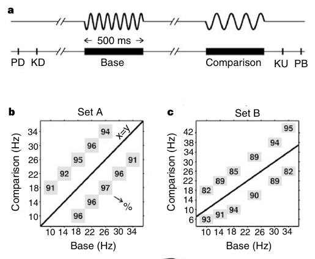
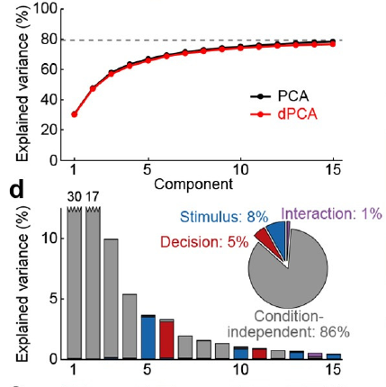
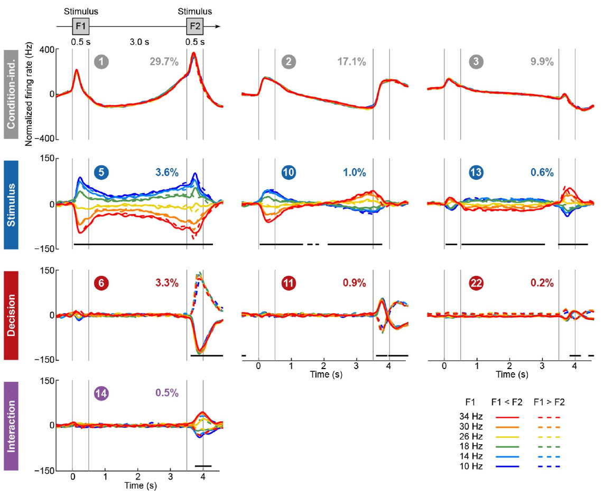

# Demixing and summarising neural activity 

<!--h-->

## Introduction

We have data (spike trains). Loads of it. 

**What do we do???**

<!--v-->

### What needs to be demixed? 

we say that neurons in higher cortical areas display this because they are tuned to a variety of sensory and motor variables (i.e., it is not clear cut what they code for). Or [Raposo Kaufman Churchland (2014)]: individual neurons are modulated by multiple task parameters

(maybe cite more papers on mixed selectivity)

mixed selectivity at the level of: 

 - individual neurons: neuron codes for both \(x\) and \(y\),  
 - population
  - part of population code for \(x\), part of population codes for \(y\)
  - OR all individual neurons have mixed selectivity 

<!--v-->
  
  
### What is "summarising"?

 - we want to describe the dynamics of neural activity in lower dimensions 
 - ie. explains variability of the data: both variability due to task parameters and intrinsic stochasticity (the neuron is irregular)
  - you want resonstruct your data with lower dimensions 
  
<!--h-->

## Approaches

| Method | Demix? | Summarise | 
|---------|---------|----------|
| statistical test | Yes | No |
| PCA, GPFA, ... | No | Yes |
| LDA | Yes | No |
| dPCA (insert emoji) | Yes | Yes |

We'll focus on [Kobak et al 2016: Demixed principal component analysis of neural population vector](https://elifesciences.org/articles/10989)

<!--v-->

### Traditional statistical tests

 - The 'standard' approach of neuroscience: performing a t-test (or any two-sample comparison test) of the firing rate of each neuron before and after the stimulus/response can be thought of as demixing. 
  - you find $x$ % of neurons that respond to $a$ and $y$ % of neurons that respond to $b$
  - however, you limit the space of neural activity which you think provides information about the stimulus; you only consi
  - a better approach will be to consider the activity of all neurons together: do demixing at the population level 

<!--v-->

### PCA: quick introduction 

Matrices transform vectors. 

[include plot]

<!--v-->

### PCA: projections 

A non-square matrix performs a projection when it transform a vector to a space with different dimension.

[include plot]

 - number of columns: dimension of your input 
 - number of rows: dimension of your output

<!--v-->

### PCA: objective 

PCA tries to find the projection matrix that minmise reconstruction error: 

$$
\vert \vert X - D^\intercal D X \vert\vert^2
$$

where: 

 - $D$ is a fat short matrix (column > row)
 - $DX$ is the projection to your PC space 
 - $D^\intercal (DX)$ projects back (reconstruct) to the original space 
 
<!--v-->
 
### dPCA 

We start with our data \(X\) 

 - dimensions: \(N \times KSQT\)
    - \(K\) trials 
	- \(S\) stimulus 
	- \(Q\) decisions 
	- \(T\) time bins 
 
 We decompose the activity of each neuron by the contribution of each experiment variable and their interactions: 
 
 \begin{align}
 x^i_{tdsk} &= \bar{x} + \bar{x}_t + \bar{x}_s + \bar{x}_d + \bar{x}_{ts} + \bar{x}_{td} + \bar{x}_{sd} + \bar{x}_{tsd} + \varepsilon_{tdsk} \\
 &\stackrel{\tiny grouping}{=} \bar{x} + \bar{x}_t + \bar{x}_{ts} + \bar{x}_{td} + \bar{x}_{tsd} + \varepsilon_{tdsk}
 \end{align}
 
<!--v-->
 
### dPCA: taking the mean 

[matrix / tensor plots]

<!--v--> 
 
### dPCA: objective 

We only want to reconstruct the contribution of each experiment variable individually, and we assume there's noise: 

$$
X = \sum_\phi X_\phi + X_\text{res}
$$

Demixed PCA tries to balance two goals: demixing and summarising .

<!--h-->

## Principles of dimensionality reduction for demixing 

<!--h-->

## Results of dPCA

<!--v-->

### Example of applying demixed PCA : task

Romo 1999: Monkeys compare frequency of two vibrations 

<!--v-->

### Example of applying demixed PCA : input data

 - Input data: we separate out our neural data based on stimulus condition: there are '6' possible stimulus conditions 
 - The input data is also separated out according to 2 decisions 
 - You then run dPCA through this data 
 
 <!--v-->
 
### Example of applying demixed PCA : output of dPCA 

Same as PCA, dPCA gives you the top $n$ (user-specified) principal components. 
But dPCA also gives you the experimental variable which the component explains most of the variability of neural activity: 

 1. Stimulus component: axis that best demixes the differences in neural activity due to differences in stimulus 
 2. Decision component: differences in decision (and time) best demixes
 3. Interaction component: variability due to interaction between stimulus and decision 
 4. Condition-independent: does not depend on particular stimulus / decision, but due to either factors that vary with time (eg. the fact that you are presenting the vibration from time $t_1$ to time $t_2$
 

<!--v-->

### Example of applying demixed PCA: looking at how each PC vary with time 

<!--h-->

## Other demixing methods

Non-linear extension of dPCA using kernels (kdPCA): [Latimer 2019: Nonlinear demixed component analysis for neural population data as a low-rank kernel regression problem](https://nbdt.scholasticahq.com/article/11523-nonlinear-demixed-component-analysis-for-neural-population-data-as-a-low-rank-kernel-regression-problem)

Unsupervised method that (surprisingly!) also demix (TCA): [Williams et al. 2018: Unsupervised Discovery of Demixed, Low-Dimensional Neural Dynamcis across Multiple Timescales through Tensor Component Analysis](https://www.sciencedirect.com/science/article/pii/S0896627318303878)
- They claim it's a "natural generalization of PCA to higher-order tensors" (but see Joana's and Maneesh's _Joint Factorization_)

<!--h-->

## Other dimensionality reduction methods 

Good reviews papers:

 - [Cunningham and Byron 2014: Dimensionality reduction for large-scale neural recordings](https://www.nature.com/articles/nn.3776)
 

<!--h-->

### PCA 

<!--h-->

### Factor analysis

<!--h-->

### t-SNE

<iframe frameborder="0" width="100%" height="500pt" src="https://distill.pub/2016/misread-tsne/"></iframe>

<!--v-->

Pros

 - list 
 - of 
 - pros

Cons 

 - list 
 - of 
 - cons

<!--v-->

Some example implementations:

 - [Dimitriadis 2018: t-SNE visualization of large scale neural recordings](https://www.mitpressjournals.org/doi/full/10.1162/neco_a_01097)

<!--h-->

### Gaussian Process Factor Analysis 

<!--h-->

### Independent Component Analysis 

<!--h-->

### Latent Factor Analysis via Dynamical Systems (LFADS)

[Pandarinath 2018: Inferring single-trial neural population dynamics using sequential auto-encoders](https://www.nature.com/articles/s41592-018-0109-9)

<!--h-->

### Tier-list of dimensionality reduction methods

